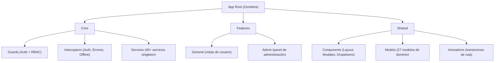

# Smart Economato  
  
Interfaz de usuario del ecosistema **Smart Economato**: una Progressive Web App (PWA) construida con Angular 21 que proporciona la experiencia de usuario completa para la gestión de inventario, recetas, pedidos, planificación semanal y más en escuelas culinarias y cocinas profesionales. Incluye un asistente de IA conversacional, notificaciones en tiempo real vía WebSocket y soporte multiidioma.  
  
## Arquitectura  
  
La aplicación sigue una arquitectura modular basada en **standalone components** con carga diferida (lazy loading) y detección de cambios **Zoneless**. Se estructura en tres capas principales:  
  

  
## Módulos funcionales  
  
| Área | Módulo | Ruta | Roles |  
|------|--------|------|-------|  
| **General** | Inventario | `/inventario` | Todos |  
| | Recetas | `/recipes` | Todos |  
| | Pedidos | `/orders` | ADMIN, CHEF |  
| | Recepción | `/reception` | ADMIN, CHEF |  
| | Planes semanales | `/weekly-plans` | CHEF |  
| | Chat IA (Chef Pío) | `/ai-chat` | Todos |  
| | Incidencias | `/incidents` | ADMIN, CHEF |  
| | Perfil | `/profile` | ADMIN, CHEF |  
| **Admin** | Dashboard | `/admin-panel/dashboard` | ADMIN |  
| | Gestión de usuarios | `/admin-panel/users` | ADMIN |  
| | Gestión de recetas | `/admin-panel/recipes` | ADMIN |  
| | Gestión de productos | `/admin-panel/products` | ADMIN |  
| | Gestión de lotes | `/admin-panel/batches` | ADMIN |  
| | Datos maestros (alérgenos) | `/admin-panel/master-data` | ADMIN |  
| | Gestión de cocina | `/admin-panel/kitchen` | ADMIN |  
| | Gestión de stock | `/admin-panel/stock` | ADMIN |  
| | Gestión de pedidos | `/admin-panel/orders` | ADMIN |  
| | Planes semanales | `/admin-panel/weekly-plans` | ADMIN |  
| | Notificaciones | `/admin-panel/notifications` | ADMIN |  
| | Incidencias | `/admin-panel/incidents` | ADMIN |  
| | Trazabilidad | `/admin-panel/traceability` | ADMIN |  
| | Proveedores | `/admin-panel/suppliers` | ADMIN |  
| | Configuración | `/admin-panel/settings` | ADMIN |  
  
## Requisitos previos  
  
- **Node.js** >= 20  
- **npm** >= 11  
- **Angular CLI** >= 21  
- **Docker** y **Docker Compose** (opcional, para despliegue)  
  
## Instalación y desarrollo  
  
```bash  
# 1. Clonar el repositorio  
git clone https://github.com/user-ijavieh/smart-economato.git  
cd smart-economato  
  
# 2. Instalar dependencias  
npm install --legacy-peer-deps  
  
# 3. Iniciar servidor de desarrollo  
ng serve  
```  
  
Navegar a `http://localhost:4200/`. La aplicación se recarga automáticamente ante cambios en el código fuente.  
  
## Despliegue con Docker  
  
El proyecto incluye un `Dockerfile` multi-stage y un `docker-compose.yml` para despliegue en contenedores:  
  
```bash  
docker compose up -d --build  
```  
  
El proceso de build:  
1. **Etapa de compilación** — Node 20 Alpine: instala dependencias, compila en modo producción e inyecta un timestamp en el Service Worker para invalidación de caché.  
2. **Etapa de servicio** — Nginx Alpine: sirve los archivos estáticos con configuración SPA (`try_files`).  
  
| Parámetro | Valor |  
|-----------|-------|  
| Puerto expuesto | `8082` (mapeado al `80` interno de Nginx) |  
| Red | `turing-backend_inventory-network` (externa, compartida con el backend) |  
| Restart policy | `unless-stopped` |  
  
## Variables de entorno  
  
La configuración por entorno se gestiona mediante los archivos en `src/environments/`:  
  
| Archivo | Descripción |  
|---------|-------------|  
| `environment.ts` | Configuración de desarrollo |  
| `environment.prod.ts` | Configuración de producción (inyectada en build) |  
  
## Estructura del proyecto  
  
<details>  
<summary>Expandir estructura de directorios</summary>  
  
```  
smart-economato/  
├── src/  
│   ├── app/  
│   │   ├── core/                          # Capa central (singleton)  
│   │   │   ├── constants/                 # Constantes de la aplicación  
│   │   │   │   └── search.constants.ts  
│   │   │   ├── guards/                    # Protección de rutas  
│   │   │   │   ├── auth.guard.ts          # Verificación de autenticación  
│   │   │   │   └── role.guard.ts          # Control de acceso RBAC  
│   │   │   ├── interceptors/              # Interceptores HTTP  
│   │   │   │   ├── auth.interceptor.ts    # Inyección de token JWT  
│   │   │   │   ├── errorHandling.interceptor.ts  # Manejo global de errores  
│   │   │   │   └── offline-sync.interceptor.ts   # Sincronización offline  
│   │   │   ├── services/                  # 40+ servicios singleton  
│   │   │   │   ├── auth.service.ts  
│   │   │   │   ├── websocket.service.ts  
│   │   │   │   ├── ai-chat.service.ts  
│   │   │   │   ├── notification.service.ts  
│   │   │   │   ├── theme.service.ts  
│   │   │   │   ├── language.service.ts  
│   │   │   │   ├── offline-sync.service.ts  
│   │   │   │   ├── logger.service.ts  
│   │   │   │   └── ...  
│   │   │   └── utils/  
│   │   │       └── credentials-generator.ts  
│   │   ├── features/                      # Módulos funcionales  
│   │   │   ├── admin/                     # Panel de administración (16 módulos)  
│   │   │   │   ├── admin-panel/  
│   │   │   │   ├── dashboard-management/  
│   │   │   │   ├── users-management/  
│   │   │   │   ├── recipes-management/  
│   │   │   │   ├── products-management/  
│   │   │   │   ├── batches-management/  
│   │   │   │   ├── allergens-management/  
│   │   │   │   ├── kitchen-management/  
│   │   │   │   ├── stock-management/  
│   │   │   │   ├── orders-management/  
│   │   │   │   ├── weekly-plans-management/  
│   │   │   │   ├── notifications-management/  
│   │   │   │   ├── incidents/  
│   │   │   │   ├── traceability-management/  
│   │   │   │   ├── suppliers-management/  
│   │   │   │   └── settings-management/  
│   │   │   └── general/                   # Vistas generales (11 módulos)  
│   │   │       ├── ai-chat/  
│   │   │       ├── barcode-scanner/  
│   │   │       ├── change-password/  
│   │   │       ├── inventory/  
│   │   │       ├── login/  
│   │   │       ├── orders/  
│   │   │       ├── profile/  
│   │   │       ├── reception/  
│   │   │       ├── recipes/  
│   │   │       ├── weekly-plans/  
│   │   │       └── welcome/  
│   │   └── shared/                        # Componentes y modelos compartidos  
│   │       ├── animations/  
│   │       │   └── route-animations.ts  
│   │       ├── components/  
│   │       │   ├── base-modal/  
│   │       │   ├── layout/  
│   │       │   ├── multi-select-dropdown/  
│   │       │   ├── order-builder/  
│   │       │   ├── pwa-install-banner/  
│   │       │   ├── pwa-offline-status/  
│   │       │   └── searchable-dropdown/  
│   │       └── models/                    # 27 modelos de dominio  
│   │           ├── product.model.ts  
│   │           ├── recipe.model.ts  
│   │           ├── order.model.ts  
│   │           └── ...  
│   ├── assets/  
│   │   └── i18n/                          # Archivos de traducción  
│   │       ├── es.json                    # Español  
│   │       ├── en.json                    # Inglés  
│   │       └── ca.json                    # Catalán  
│   ├── environments/  
│   │   ├── environment.ts                 # Desarrollo  
│   │   └── environment.prod.ts            # Producción  
│   └── styles.css                         # Estilos globales con tokens semánticos  
├── public/  
│   ├── manifest.webmanifest               # Configuración PWA  
│   ├── icon-192x192.png  
│   └── icon-512x512.png  
├── Dockerfile                             # Build multi-stage (Node + Nginx)  
├── docker-compose.yml                     # Orquestación del servicio frontend  
├── nginx-custom.conf                      # Configuración Nginx para SPA  
├── angular.json                           # Configuración de Angular CLI  
├── tsconfig.json                          # Configuración de TypeScript  
└── package.json                           # Dependencias y scripts  
```  
  
</details>  
  
## Funcionalidades principales  
  
### Gestión de inventario  
- CRUD de productos con control de lotes y fechas de caducidad (FEFO)  
- Escáner de código de barras integrado (ZXing) para búsqueda rápida  
- Alertas de stock bajo en tiempo real  
  
### Recetas y planificación  
- Gestión de recetas con ingredientes, costes y alérgenos  
- Sistema de borradores con flujo de aprobación  
- Wizard de creación de planes semanales  
- Auditoría completa de cambios en recetas  
  
### Pedidos y aprovisionamiento  
- Constructor visual de pedidos (Order Builder)  
- Recepción de mercancía con integración de báscula  
- Búsqueda de pedidos por rango de fechas con calendario  
  
### Asistente de IA ("Chef Pío")  
- Chat conversacional con streaming SSE en tiempo real  
- Renderizado de respuestas en Markdown (marked)  
- Indicador de "escribiendo" y mensajes vistos  
  
### Predicción y análisis  
- Gráficas de predicción de demanda (Chart.js / ng2-charts)  
- Dashboard de administración con KPIs  
- Libro mayor (ledger) de movimientos de stock  
  
### Seguridad y acceso  
- Autenticación JWT con interceptor automático  
- RBAC con 4 roles: ADMIN, CHEF, ELEVATED, USER (STUDENT)  
- Guards de ruta por autenticación y por rol  
- Cambio de contraseña obligatorio en primer inicio de sesión  
  
### Comunicación en tiempo real  
- WebSockets (STOMP sobre SockJS) para notificaciones y alertas  
- Sincronización en tiempo real entre usuarios  
- Indicador de presencia de usuarios  
  
### PWA y experiencia offline  
- Instalable como aplicación nativa (manifest + Service Worker)  
- Interceptor de sincronización offline  
- Banner de instalación y estado de conexión  
- Cache busting automático en cada despliegue  
  
### Temas e internacionalización  
- Modo claro/oscuro con tokens semánticos CSS y estado persistente  
- Soporte multiidioma: Español, Inglés y Catalán (ngx-translate)  
- Detección automática del idioma del navegador  
  
## Scripts disponibles  
  
| Comando | Descripción |  
|---------|-------------|  
| `ng serve` | Servidor de desarrollo en `http://localhost:4200/` |  
| `ng build` | Compilación de producción con optimización y hashing |  
| `ng test` | Ejecutar tests unitarios con Vitest |  
| `ng build --watch` | Compilación en modo watch para desarrollo |  
  
## Tests  
  
```bash  
# Tests unitarios con Vitest  
ng test  
```  
  
El proyecto usa **Vitest** como framework de testing con **jsdom** como entorno de ejecución.  
  
## Stack tecnológico  
  
| Capa | Tecnología |  
|------|------------|  
| Framework | Angular 21 (Standalone Components, Zoneless) |  
| Lenguaje | TypeScript 5.9 |  
| Comunicación en tiempo real | @stomp/stompjs + sockjs-client (WebSockets) |  
| Streaming IA | SSE (Server-Sent Events) + marked (Markdown) |  
| Gráficas | Chart.js 4.5 + ng2-charts 10 |  
| Escáner | @zxing/browser + @zxing/library |  
| Internacionalización | @ngx-translate/core + @ngx-translate/http-loader |  
| PWA | @angular/service-worker + manifest.webmanifest |  
| Reactividad | RxJS 7.8 |  
| Testing | Vitest 4 + jsdom |  
| Formateo | Prettier (integrado en package.json) |  
| Servidor estático | Nginx Alpine |  
| Contenedores | Docker (multi-stage build) + Docker Compose |  
  
## Relación con el backend  
  
Este frontend se comunica con la [Smart Economato API](https://github.com/FranWDev/smart-economato-API), que proporciona:  
  
| Servicio backend | Protocolo | Uso en el frontend |  
|-----------------|-----------|-------------------|  
| `inventory-service` | REST + WebSocket | Todos los dominios de negocio |  
| `mcp-service` | SSE | Chat con IA (Chef Pío) |  
| `predictor-service` | REST (vía inventory-service) | Gráficas de predicción |  
  
## Autores  
  
| Contribuidor | GitHub | LinkedIn | 
|-------------|-------------|--------------| 
| Javier Daniel Remedios Colmenares | [@user-ijavieh](https://github.com/user-ijavieh) | [LinkedIn](https://www.linkedin.com/in/javier-remedios)|
| Francisco Airam Hernández Crosa | [@FranWDev](https://github.com/FranWDev) | [LinkedIn](https://www.linkedin.com/in/franciscohdezcrosa)|
| Lorena Fumero Delgado| [@lorena-fudel](https://github.com/lorena-fudel) | [LinkedIn](https://www.linkedin.com/in/lorenafumerodelgado) |
| Daniel Pascual Bezanilla| [@blablabla277](https://github.com/blablabla277) | [LinkedIn](https://www.linkedin.com/in/daniel-pascual-bezanilla-35b85a28a/) |
  
## Licencia  
  
Este proyecto se distribuye bajo la licencia **Creative Commons Attribution-NonCommercial-ShareAlike 4.0 International (CC BY-NC-SA 4.0)**.  
  
Esto significa que puedes:  
  
- **Compartir**: Copiar y redistribuir el material en cualquier medio o formato.  
- **Adaptar**: Remezclar, transformar y construir sobre el material.  
  
Bajo las siguientes condiciones:  
  
- **Atribución**: Debe otorgar el crédito correspondiente y proporcionar un enlace a la licencia.  
- **No Comercial**: No puede utilizar el material con fines comerciales sin permiso previo.  
- **Compartir Igual**: Si remezcla, transforma o crea a partir del material, debe distribuir sus contribuciones bajo la misma licencia que el original.  
  
Para usos comerciales, por favor contacta con el autor.
